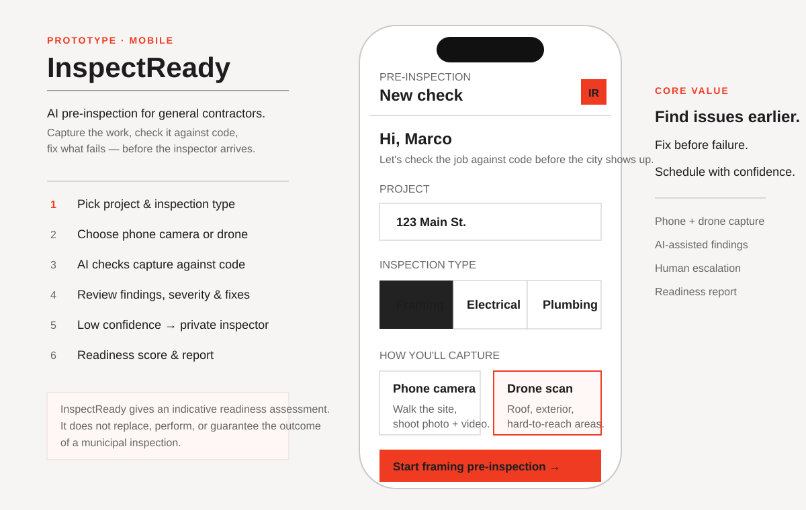
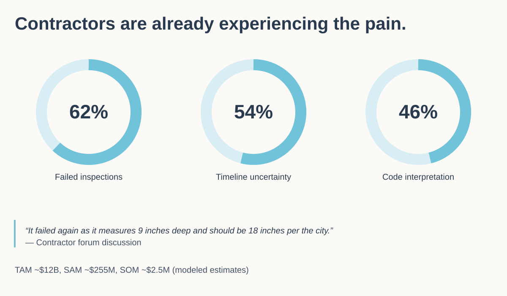

# InspectReady

**Know before the inspector arrives.**

InspectReady is a contractor-focused **pre-inspection readiness concept** developed during **Risk & Return: Turning Data Into Business Decisions**, a Build Project in **The Build Fellowship by Open Avenues Foundation**.

The project explores a practical construction workflow problem: contractors may discover code-related issues only when the municipal inspector arrives, creating rework, repeat visits, idle labor, and project delays.



## Project goal

The goal was not simply to design an app. The project used a structured business-analysis process to determine whether the problem is meaningful, whether a solution is feasible, and whether the market could support a viable product.

## What I worked on

- Problem discovery and problem framing
- Primary-user definition
- Qualitative customer research
- Forum and contractor pain-point analysis
- Competitor and alternative-solution research
- TAM / SAM / SOM market sizing
- Risk and assumption analysis
- Crazy 8's ideation
- Solution sketching
- Prototype development
- Business-model hypotheses
- Final recommendation and pitch

## The problem

General contractors can finish a phase of work without having a reliable way to know whether it is truly ready for the official municipal inspection. If an issue is discovered only during the inspection, the contractor may need to correct the work, bring crews back, schedule a reinspection, and delay downstream work.

A simple question captures the problem:

> **Is my job actually ready for inspection?**

## Proposed solution

InspectReady adds a structured pre-inspection step before the municipal inspection.

**Core workflow:**

1. Select project and inspection type.
2. Capture evidence using a phone camera or optional drone scan.
3. Review possible issues and missing evidence.
4. Fix identified problems before the official inspection.
5. Escalate uncertain cases to a human/private inspector when needed.
6. Receive an inspection-readiness report.

The product is intended as an **inspection-readiness assistant**. It does not replace the authority of municipal inspectors or guarantee approval.

## Early validation

The qualitative research used contractor/forum discussions to identify recurring pain points. The project deck summarized the sample as:

- **62%** — failed inspections, rework, or repeat inspection visits
- **54%** — slow or unpredictable inspection timelines
- **46%** — code-interpretation or inspector-expectation challenges

These are **directional findings from a qualitative sample, not national survey statistics**.



## Market sizing

The project used a modeled TAM / SAM / SOM framework to test whether the opportunity could support a business.

- **TAM:** approximately **$12B** modeled annual opportunity
- **SAM:** approximately **$255M**, using ~212K U.S. residential contractor establishments and assumed annual pricing
- **SOM:** approximately **$2.5M**, using ~2,100 early customers and assumed pricing

These are **modeled estimates** rather than audited market figures. Pricing and reachable customer counts require further primary validation.

## Competitive landscape

The research reviewed several categories of existing solutions:

- Municipal systems: Accela, OpenGov
- Construction management: Procore, Autodesk Construction Cloud
- Inspection/checklist software: SafetyCulture
- Emerging AI inspection tools: Specta, Infrava Inspect, Tradei Vision
- Human/private inspection services

The opportunity explored in this project is a contractor-facing workflow that combines **field evidence capture, inspection-readiness analysis, optional drone capture, human escalation, and a final readiness report**.

## Business-model hypotheses

The project considered several revenue options:

- SaaS subscription
- Pay per pre-inspection
- Private-inspector marketplace commission
- Premium drone-inspection add-on

These are hypotheses that still require willingness-to-pay testing.

## Next validation steps

1. Interview 10–15 general contractors.
2. Interview building and private inspectors.
3. Measure failure frequency and rework cost.
4. Test willingness to pay.
5. Test contractor trust in AI-assisted findings.
6. Choose one inspection category for the MVP.
7. Research jurisdiction-specific code-data access.
8. Run a small real-world contractor pilot.

## Project process

See [`docs/project-process.md`](docs/project-process.md) for the complete workflow from problem discovery to final pitch.

## Repository structure

```text
InspectReady-Business-Analysis/
├── README.md
├── docs/
│   ├── case-study.md
│   ├── project-metadata.md
│   └── project-process.md
├── ideation/
│   ├── crazy-8s.svg
│   ├── solution-sketch.svg
│   └── README.md
├── presentation/
│   └── final-pitch-deck.md
├── prototype/
│   ├── inspectready-prototype.svg
│   └── README.md
└── research/
    ├── competitive-landscape.md
    ├── market-sizing.md
    ├── market-validation.svg
    └── problem-validation.md
```

## Context

**Role:** Student Consultant  
**Program:** The Build Fellowship by Open Avenues Foundation  
**Build Project:** *Risk & Return: Turning Data Into Business Decisions*  
**Project:** InspectReady

---

This repository documents an early-stage business-analysis and prototype project. It is not a production inspection system and should not be used as a substitute for licensed professional or municipal inspection.
