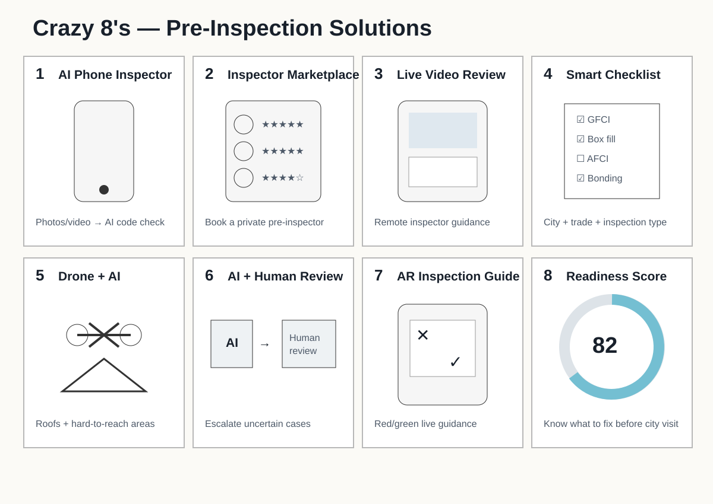
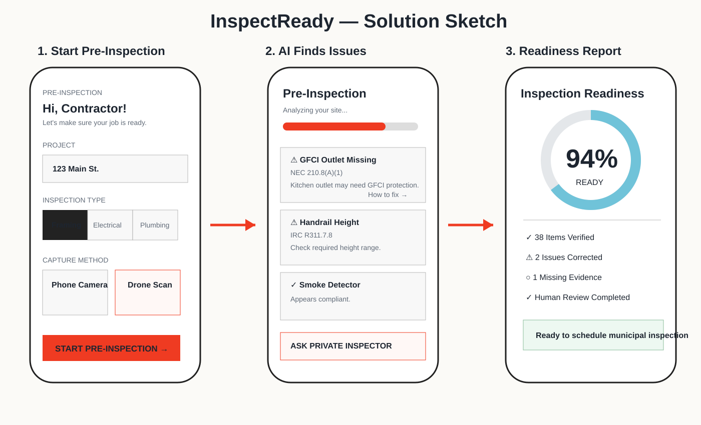

# Ideation

The project used Crazy 8's to avoid jumping directly to one solution.

## Concepts explored

- AI phone inspector
- Private-inspector marketplace
- Live video pre-inspection
- Smart code checklist
- Drone + AI inspection
- AI + human hybrid review
- AR inspection assistant
- Inspection-readiness score

## Crazy 8's

## Winning solution sketch

The final concept combined field evidence capture, automated analysis, human escalation, and a readiness report.

